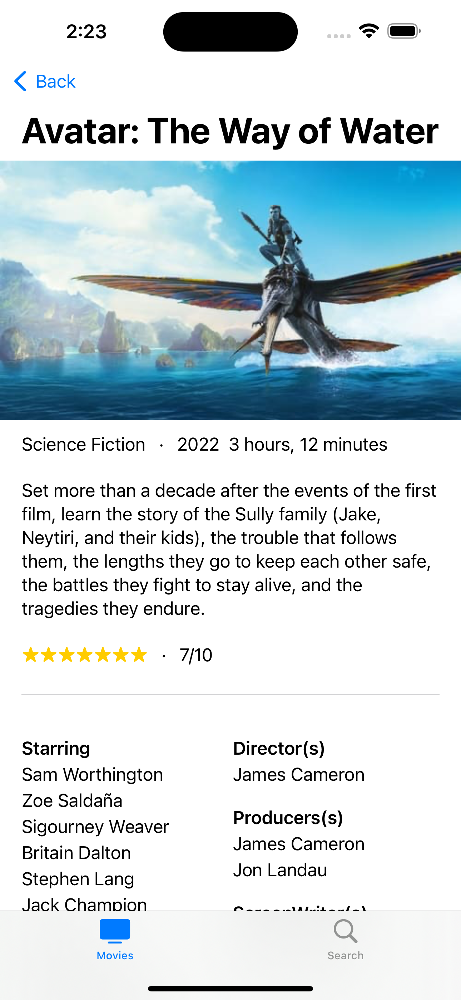

# Movie-Finder-SwiftUI

This is my first SwiftUI Project based on the TMDB API.
In order to make it work, you will need:

- Git
- XCode

## Downloading:
SSH: 
```
git clone git@github.com:BullsEye34/Movie-Finder-SwiftUI.git
```

HTTP/HTTPS: 
```
git clone https://github.com/BullsEye34/Movie-Finder-SwiftUI.git
```

## Running
In order for the application to work:
1. Open the project in XCode
2. `cd Movie-Finder-SwiftUI/Movie Finder/Resources`
3. Create a new File: `Secrets.swift`
4. Paste the below as the contents of your file:
```
//
//  Secrets.swift
//  Movie Finder
//
//  Created by P Vamshi Prasad on 20/01/23.
//

import Foundation

let movieApiKey = "<YOUR_API_KEY>";
```
5. Replace `<YOUR_API_KEY>` with your actual API Key from https://www.themoviedb.org/settings/api after creating account/logging in.
6. Run the project on your device/Simulator
7. Enjoy

This project is a recreation from the YouTube Video: https://youtu.be/cTNhMgNV53s . It was fast, but really helpful. Thanks a lot Alfian.

# This project is complete. There will be no more commits to this project.

# Screenshots:


> Home Screen



> Movie Details Screen


> Search Screen


> Search Movie Details Screen - Part 1


> Search Movie Details Screen - Part 2


> Movie Trailer WebView
